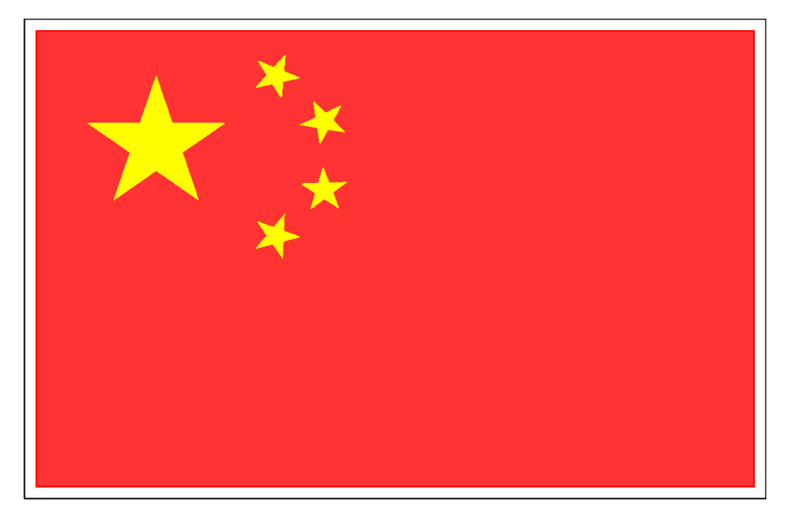

大家好，国庆节快乐！今天我们用Stata绘制一面五星红旗。

闲话少说，首先我们需要从我的github上载入数据。
```c
global github "https://raw.githubusercontent.com/zhangdashenqi"
webuse set "${github}/Stata-Graph/master/do/graph_flag"
webuse flag.dta, clear
```

这份数据`flag.dta`是分辨率为667\*1000的五星红旗图片中五颗星的位置坐标。我们绘制五星红旗的原理很简单，先绘制一个667\*1000的红色背景，然后将上述五颗星绘制上去即可。

接下来，只需要在数据中添加两个点：`(1000, -667)`和`(0, -667)`，然后通过这两个点，使用`twoway area`命令便可以绘制出红色背景。

```c
insobs 2
replace x = 1000 in -2
replace y = -667 in -2
replace x = 0    in -1
replace y = -667 in -1
```

最后使用`scatter`命令绘制黄色的五颗星星。

```c
#delimit ;
	twoway (area y x in -2/-1, color(red) base(0) ) // 红色背景
		   (scatter y x in 1/-3, msize(vtiny) mcolor(yellow)), // 黄色星星
		ytitle("")
		xtitle("")
		ylabel(none)
		xlabel(none)
		xsize(10)
		ysize(6.67)
		legend(off)
		scheme(s1color)
	;
#delimit cr
```

就得到了一面五星红旗：

