前面三篇文章介绍了Stata中对数据透视或者统计相关的图表操作。好巧不巧，这份数据是关于各个省份的数据，因此将其绘制成地图的形式，将会使人更加一目了然。

本篇将介绍空间数据的可视化，即地图的绘制。

### 提要

[toc]

### 1. 数据的透视

关于这份数据的介绍可参看前面三篇文章，传送门：

（连接1）
（连接2）
（连接3）

首先导入数据，然后进行简单处理：

```
import excel "机构退出列表.xls", sheet("许可证情况导出") firstrow clear
	
gen year = yofd(date(批准成立日期, "YMD")) 		// 银行分支机构成立年份
gen quit_year = yofd(date(发生日期, "YMD"))  	// 银行分支机构退出年份
gen age = quit_year - year + 1 					// 存续时间，年龄
```

检查数据，我们发现`省份`中居然存在“厦门”。显然“厦门”并不是一个省。事实上，这个`省份`变量应该是`银监局`，有些省只有一个银监局，自然就以省份名来命名；而有些省有两个银监局，比如福建省有“福建银监局”和“厦门银监局”，广东省有“广东银监局”和“深圳银监局”。对于这些城市的银监局，应将其数据并入所在省。

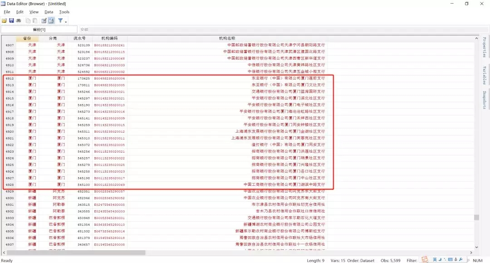

对这些数据修正然后保存：

```javaScript
replace 省份 = "福建" if 省份 == "厦门" 		// 修正部分数据
replace 省份 = "辽宁" if 省份 == "大连"
replace 省份 = "浙江" if 省份 == "宁波"
replace 省份 = "山东" if 省份 == "青岛"
replace 省份 = "广东" if 省份 == "深圳"

rename 省份 prov            // 重命名，后面以此变量进行合并数据
save bank.dta, replace      // 保存数据
```

然后我们对数据进行透视，获得各省市的银行数量`banknum`以及退出机构的平均年龄`age`：

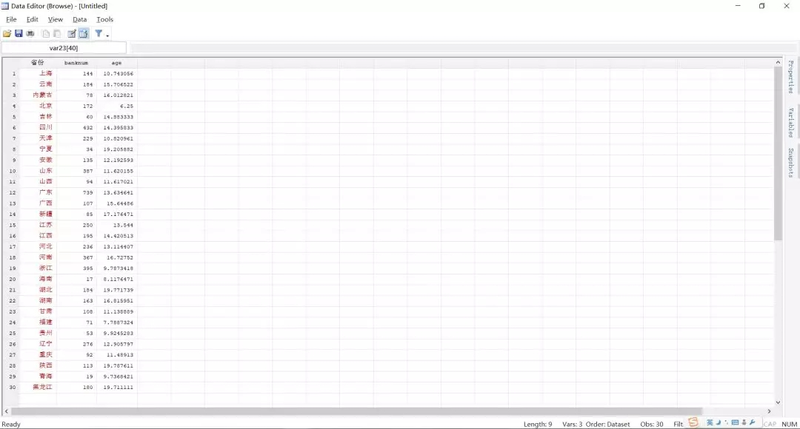

对于上述内容有疑问的，可参考：

（连接1）

### 2. Stata绘制地图的原理

Stata绘制地图需要使用以下命令，请先安装：

```
ssc install spmap
ssc install shp2dta
ssc install mif2dta
```

绘制地图一般需要一份带有标签的数据和一份地理坐标数据。先下载一份中国的省级地图到本地目录下：

```
copy "http://fmwww.bc.edu/repec/bocode/c/china_map.zip" china_map.zip, replace
unzipfile china_map, replace  // 解压压缩文件
```

解压缩之后会有三个文件：标签数据`china_label.dta`、坐标数据`china_map.dta`以及一个绘图示例的do文件`map_example.do`。你也可以按照这个示例操作一遍。

由于标签数据`china_label.dta`编码方式并非unicode，因此部分中文字符会呈现乱码的形式，可用一下方式进行转码：
```
clear
unicode encoding set gb18030
unicode translate china_label.dta

```

准备工作做完之后，我们简单介绍一下Stata绘制地图的原理。先打开坐标数据，将坐标数据`_Y`和`_X`做成散点图：

```
use china_map.dta, clear
scatter _Y _X, msize(vtiny)
```
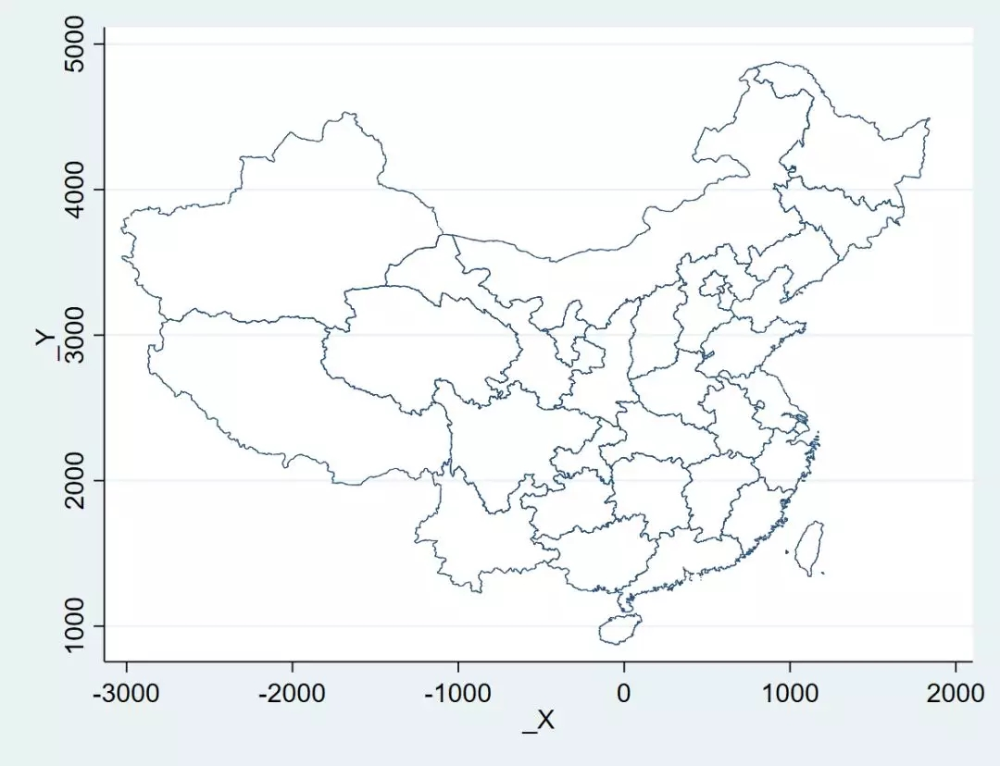

可以看出，这些坐标点的所形成的轮廓就是中国地图。对比标签数据和坐标数据：

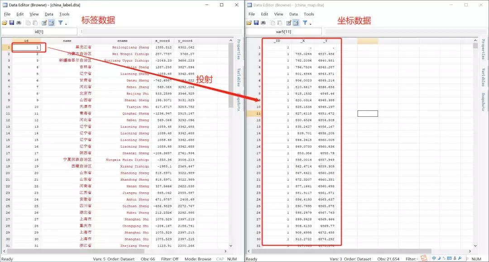

可以看出标签数据和坐标数据是通过变量`id`（或`_ID`）连接的。标签数据中`id=1`对应着黑龙江省
，坐标数据中`_ID=1`对应的`_X`、`_Y`坐标围成的图形就是黑龙江省。因此，**Stata绘制地图的原理就是，通过标签数据中的`id`变量投射到其相应坐标围成的图形上。**

简单验证下，我们绘出黑龙江的地图：

```
use china_map.dta, clear
scatter _Y _X if _ID==1, msize(tiny)
```
结果如下：

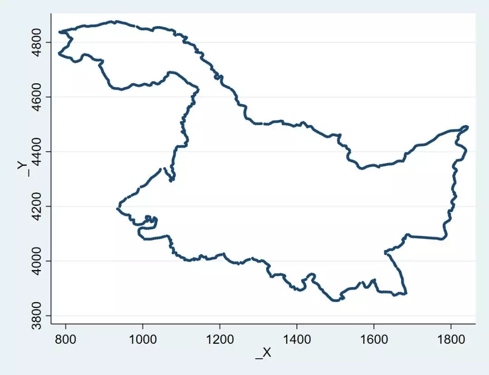

可以看出，这些坐标围城的图形确实是黑龙江省。

但是**需要注意的是，这种投射并非一一对应关系**。对于一些大陆板块，他们的陆地是相连的，因此可以1对1投射。但是有海岛的板块，却是1对多的投射。以浙江省为例，浙江省在标签数据中的`id`为31~38，我们绘制出响应的图：

```
use china_map.dta, clear
scatter _Y _X if _ID>=31 & _ID<=38, msize(tiny)
```
可以看出地图的右上角确实有许多小岛：

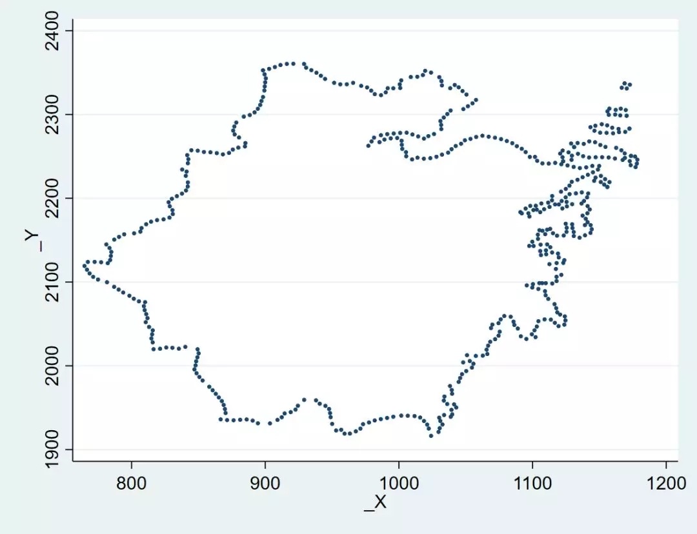

由于这份地图数据的精确度不是很高，忽略了很多小岛，因此`_ID`的个数比较少。对于精确度较高的地图坐标数据，`_ID`的个数可能上万。

但是只要了解了地图绘制的原理，我们就可以相应增删一些地图坐标数据，以使地图能体现出更多细节或者绘制过程更快。

### 3. 绘制地图

在绘制地图之前，我们需要将前面处理过的数据`bank.dta`与标签数据`china_label.dta`按照省份进行合并。

但是这两份数据的省份表示有些出入，我们需稍做处理。在`bank.dta`中的“黑龙江”应该对应`china_label.dta`中的“黑龙江省”，“内蒙古”对应“内蒙古自治区”，“新疆”对应“新疆维吾尔自治区”，等等。

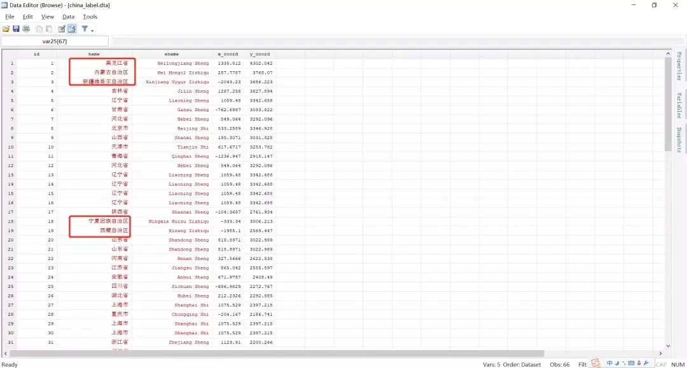

因此我们需要将`china_label.dta`数据中`name`变量中的“省”、“市”、“维吾尔”、“回族”、“壮族”、“自治区”、“特别行政区”去掉，并生成新的变量`prov`用于合并数据。这里我们采用正则表达式的方式进行（对正则表达式有疑问的，可参考：------）。

```
use china_label.dta, clear
gen prov = ustrregexra(name, "省|市|维吾尔|回族|壮族|自治区|特别行政区", "")

save china_prov.dta, replace 
```

接下来我们合并数据：

```
use bank.dta, clear
merge 1:m prov using china_prov.dta
list if _merge==2  // 列示没有合并的数据
```
结果如下：


上述地区的数据都缺省（当然还有澳门），因此数据的合并没有问题。

**绘制地图：**

```
spmap banknum using "china_map.dta", id(id) 
```

最原始版之地图：

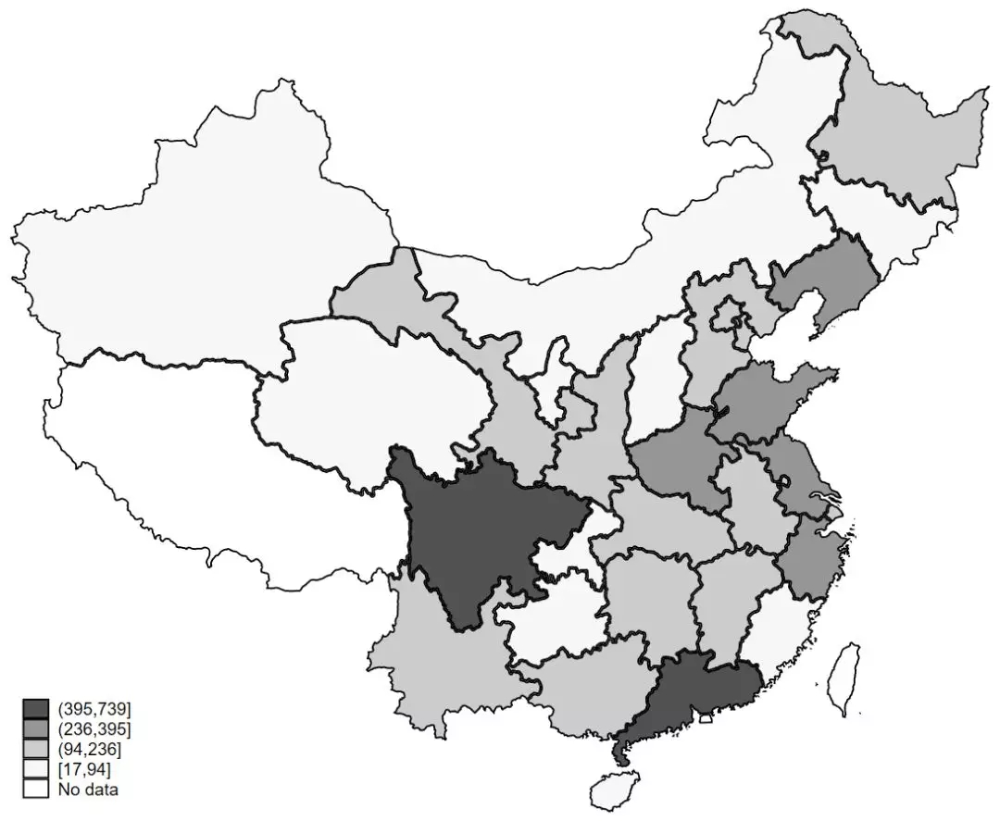

### 4. 绘制地图的进阶

在Stata中，地图的绘制恐怕用一篇文章是讲不完的。因此以下示例重在演示，详细的讲解我们会在后续的文章中退出。

#### 4.1 添加标题

```
spmap banknum using "china_map.dta", id(id) 		///
	title("银行分支机构退出情况", size(*0.8))       ///
    subtitle("2016.12-2018.11", size(*0.8))
```
图：

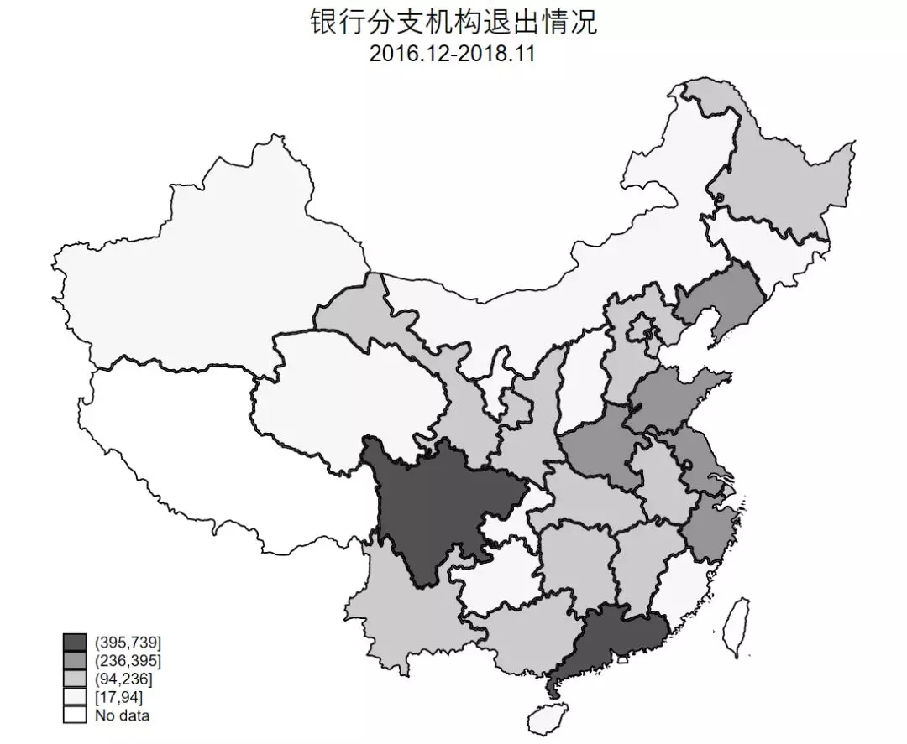

#### 4.2 填充颜色
填充颜色，图例的设置：
```
spmap banknum using "china_map.dta", id(id) 		///
	clnumber(10) fcolor(Reds2) ocolor(none ..)  	/// 
	title("银行分支机构退出情况", size(*0.8))       ///
    subtitle("2016.12-2018.11", size(*0.8))			///
	legstyle(2) legend(ring(0) position(7)) 
```

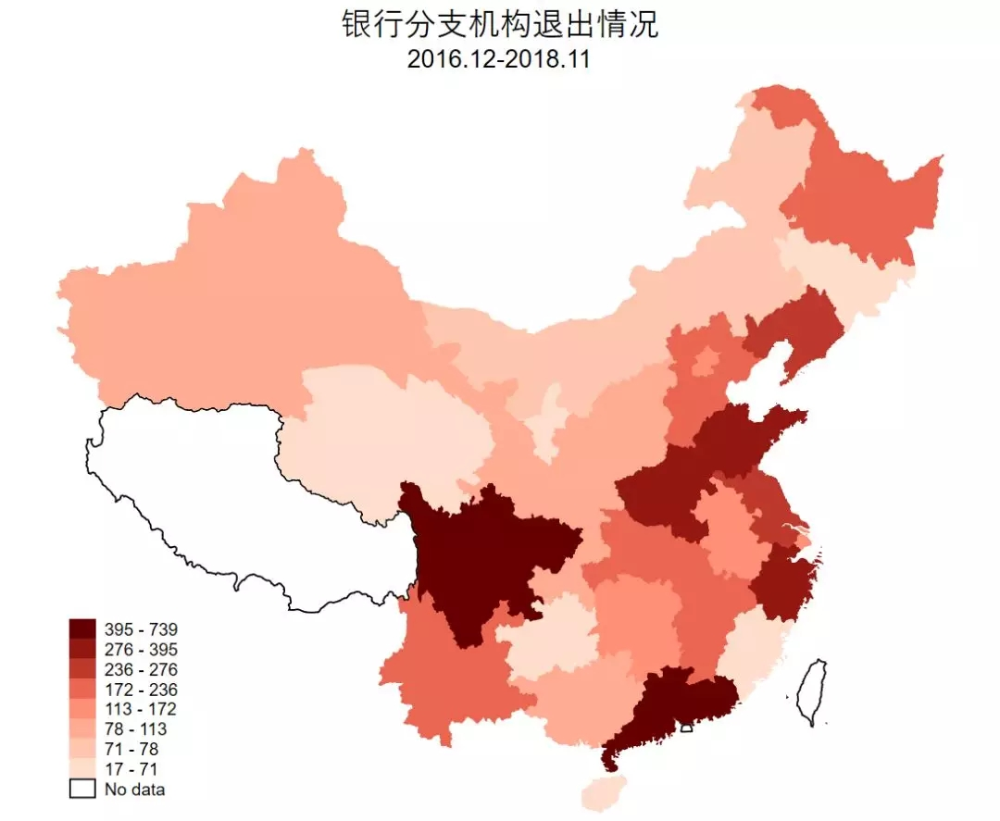

#### 4.3 背景颜色

```
spmap banknum using "china_map.dta", id(id) 		///
	clnumber(10) fcolor(Reds2) ocolor(none ..)  	/// 
	title("银行分支机构退出情况", size(*0.8))       ///
    subtitle("2016.12-2018.11", size(*0.8))			///
	legstyle(2) legend(ring(0) position(7)) 		///
	plotregion(icolor(navy*0.2)) 					///
	graphregion(icolor(navy*0.2))
```

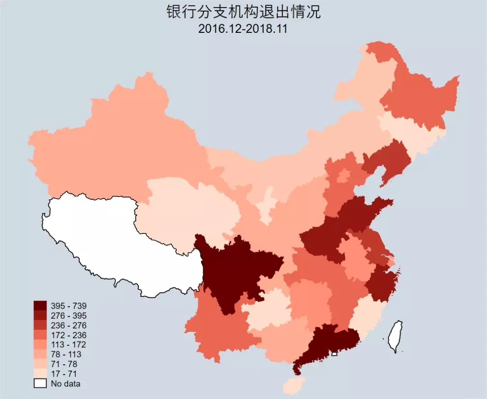

#### 4.4 文字标签

```
spmap banknum using "china_map.dta", id(id) 		///
	clnumber(10) fcolor(Reds2) ocolor(none ..)  	///
	title("银行分支机构退出情况", size(*0.8))       ///
    subtitle("2016.12-2018.11", size(*0.8))			///
	legstyle(2) legend(ring(0) position(7)) 		///
	plotregion(icolor(gs15)) 						///
	graphregion(icolor(gs15))						///
	label(label(prov) xcoord(x_coord) 				///
		  ycoord(y_coord))
```

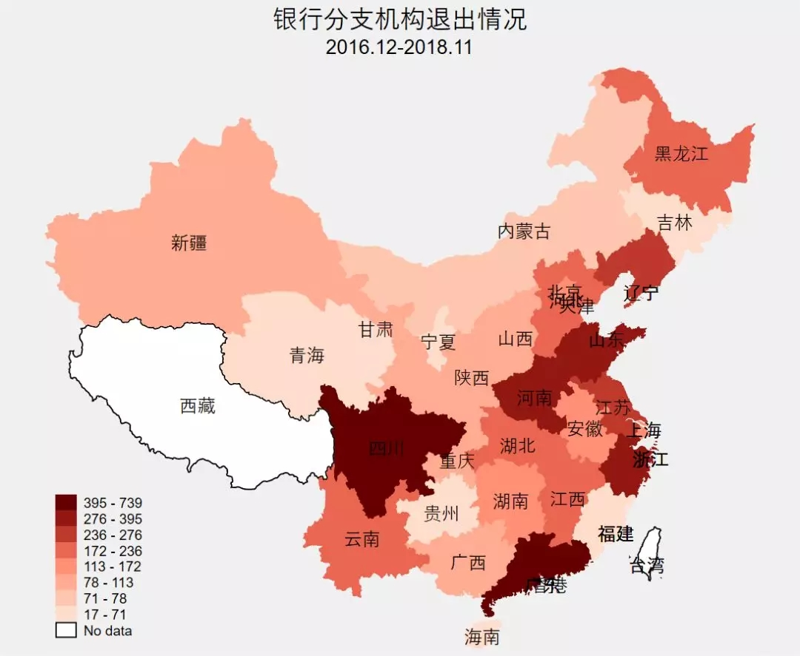

尽管有些标签是有些重合，但是是可以调整的。

#### 4.5 比例尺

```
spmap banknum using "china_map.dta", id(id) 		///
	clnumber(10) fcolor(Reds2) ocolor(none ..)  	///
	title("银行分支机构退出情况", size(*0.8))       ///
    subtitle("2016.12-2018.11", size(*0.8))			///
	legstyle(2) legend(ring(0) position(7)) 		///
	plotregion(icolor(gs15)) 						///
	graphregion(icolor(gs15))						///
	label(label(prov) xcoord(x_coord) 				///
		  ycoord(y_coord)) 							///
	scalebar(units(500) scale(1.2) 					///
			 xpos(100) ypos(-100) label(100公里))
```

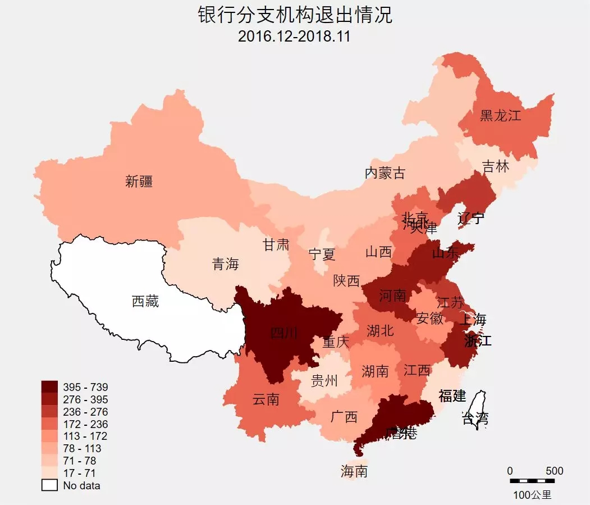

#### 4.6 附加条形统计图

地图上颜色代表银行机构退出的数量，地图上条形代表退出时的年龄：

```
label var banknum "退出机构数量"
label var age "退出机构的平均年龄"

spmap banknum using "china_map.dta", id(id) 		///
	clnumber(10) fcolor(Reds2) ocolor(none ..)  	///
	title("银行分支机构退出情况", size(*0.8))       ///
    subtitle("2016.12-2018.11", size(*0.8))			///
	legstyle(2) legend(ring(0) position(7)) 		///
	plotregion(icolor(gs15)) 						///
	graphregion(icolor(gs15))						///
	scalebar(units(500) scale(1.2) 					///
			 xpos(100) ypos(-100) label(100公里))	///
	diagram(variable(age) legenda(on) 				///
			fcolor(navy) xcoord(x_coord) ycoord(y_coord))
```


调换上述变量的位置：地图上颜色代表机构退出时的年龄，地图上条形代表退出的数量：

```
format age %02.0f
spmap age using "china_map.dta", id(id) 			///
	clnumber(10) fcolor(Blues2) ocolor(none ..)  	///
	title("银行分支机构退出情况", size(*0.8))       ///
    subtitle("2016.12-2018.11", size(*0.8))			///
	legstyle(2) legend(ring(0) position(7)) 		///
	plotregion(icolor(gs15)) 						///
	graphregion(icolor(gs15))						///
	scalebar(units(500) scale(1.2) 					///
			 xpos(100) ypos(-100) label(100公里))	///
	diagram(variable(banknum) legenda(on) 			///
			fcolor(green) xcoord(x_coord) ycoord(y_coord))
```


#### 4.7 附加扇形统计图

```
format age %02.0f
gen bankbefore = int(banknum * (1 + uniform()))
label var bankbefore "上一年机构数量（虚构）"


spmap age using "china_map.dta", id(id) 			///
	clnumber(10) fcolor(Greens2) ocolor(none ..)  	///
	title("银行分支机构退出情况", size(*0.8))       ///
    subtitle("2016.12-2018.11", size(*0.8))			///
	legstyle(2) legend(ring(0) position(7)) 		///
	plotregion(icolor(gs15)) 						///
	graphregion(icolor(gs15))						///
	scalebar(units(500) scale(1.2) 					///
			 xpos(100) ypos(-100) label(100公里))	///
	diagram(variable(banknum bankbefore)  			///
			legenda(on) type(pie) fcolor(Set3)		///
			xcoord(x_coord) ycoord(y_coord))
```

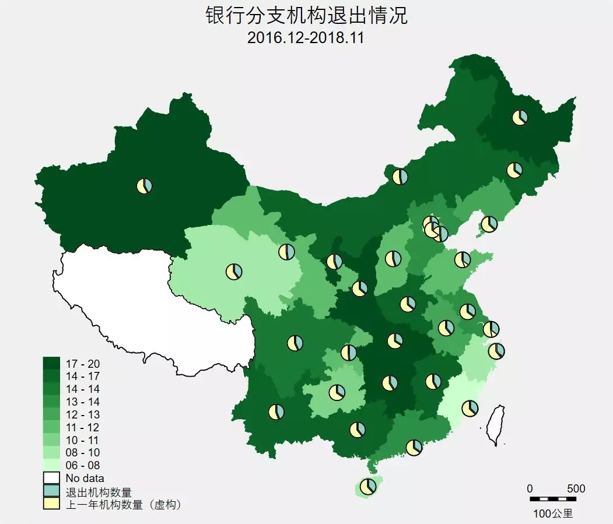

### 5. 还可以做什么？

那么还可以绘制什么样的地图呢？举几个例子

绘制铁路图：

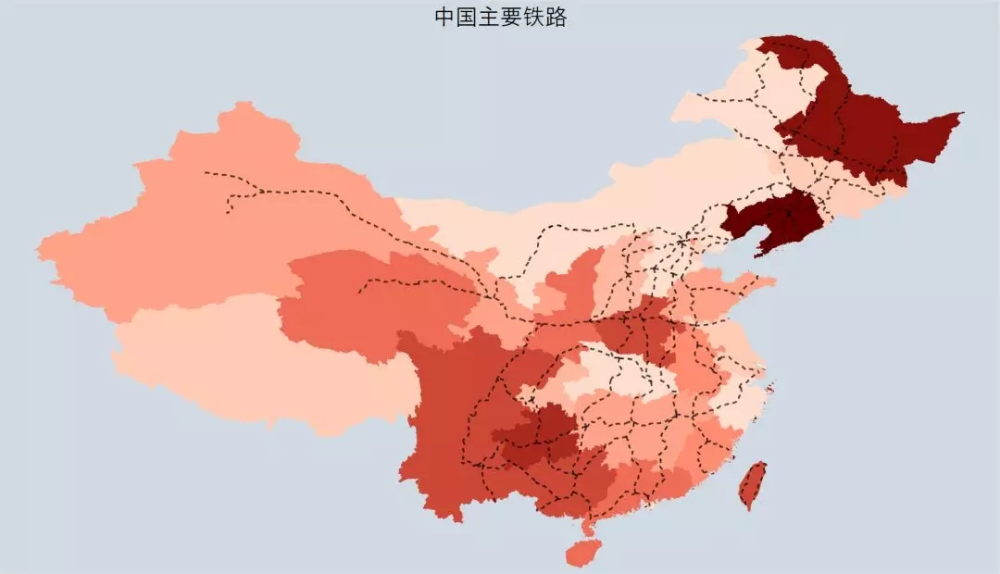

河流分布图：

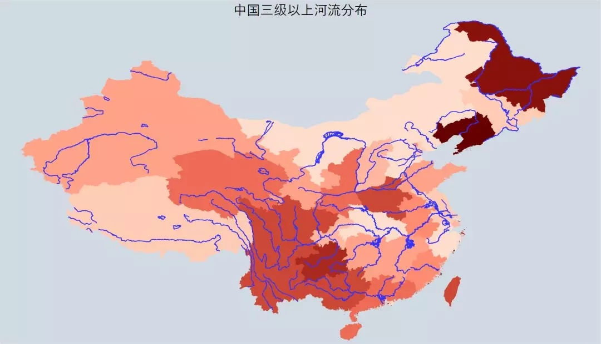

将九段线添加上去：

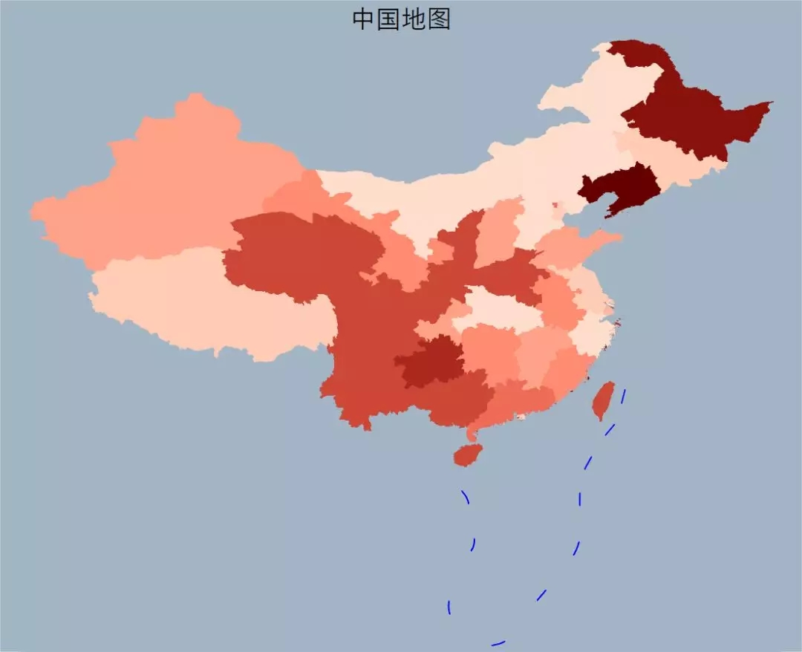

等等。

上述地图的绘制只是展示了Stata中`spmap`命令的一部分功能。即使如此，也是相当庞杂。用一篇文章的篇幅根本讲不完。

后面我们会推出一系列的关于Stata绘制地图的文章，敬请关注。
